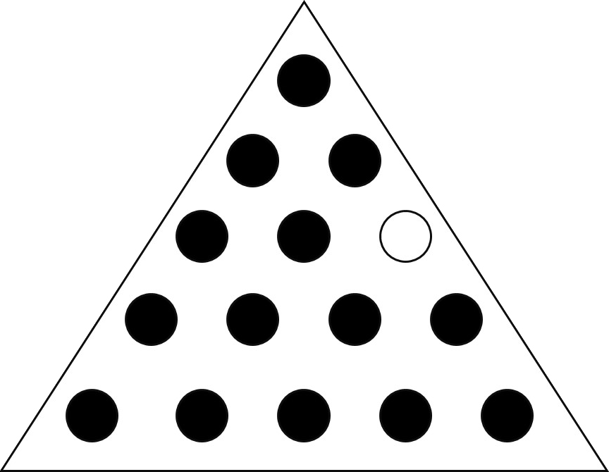
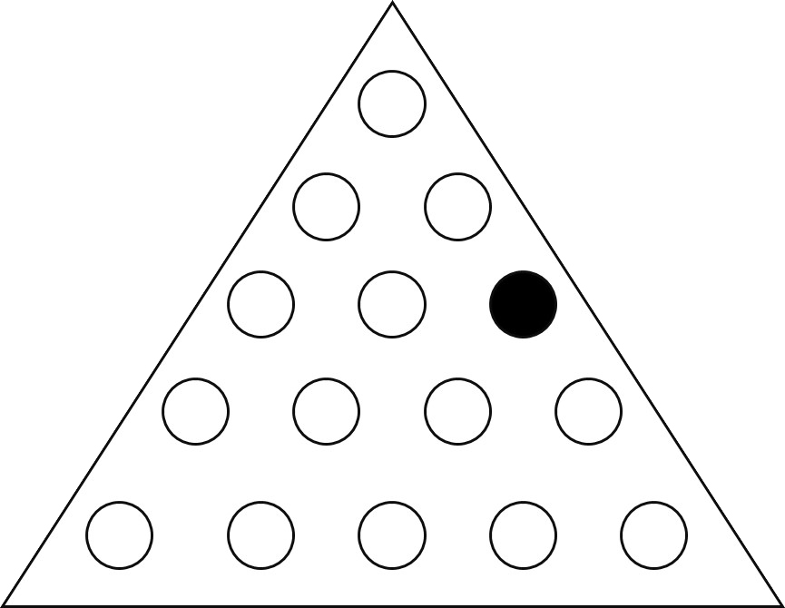

<!--
*** This readme is inspired by the Best-README-Template available at https://github.com/othneildrew/Best-README-Template. Thanks to othneildrew for the inspiration!
-->

<!-- PROJECT SHIELDS -->
<!--
*** I'm using markdown "reference style" links for readability.
*** Reference links are enclosed in brackets [ ] instead of parentheses ( ).
*** See the bottom of this document for the declaration of the reference variables
*** for contributors-url, forks-url, etc. This is an optional, concise syntax you may use.
*** https://www.markdownguide.org/basic-syntax/#reference-style-links
-->
[![Contributors][contributors-shield]][contributors-url]
[![Stargazers][stars-shield]][stars-url]
[![Issues][issues-shield]][issues-url]
[![MIT License][license-shield]][license-url]
<!-- [![Forks][forks-shield]][forks-url] -->

<!-- PROJECT LOGO -->
 

  <!-- TODO Add logo here -->
  <!--  -->

  <h1 align="center">Tricky Triangle Puzzle Solver</h3>

  

    A program to brute force a solution to the tricky triangle puzzle.
     
    <a href="https://github.com/bennett-wendorf/Tricky-Triangle-Solver"><strong>Explore the docs »</strong></a>
     
     
    <a href="https://github.com/bennett-wendorf/Tricky-Triangle-Solver/issues">Report Bug</a>
    ·
    <a href="https://github.com/bennett-wendorf/Tricky-Triangle-Solver/issues">Request Feature</a>
  

<!-- TABLE OF CONTENTS -->

  
Table of Contents

  <ol>
    <li>
      <a href="#about-the-project">About The Project</a>
      <ul>
        <li><a href="#built-with">Built With</a></li>
      </ul>
    </li>
    <li>
      <a href="#getting-started">Getting Started</a>
    </li>
    <li><a href="#contributing">Contributing</a></li>
    <li><a href="#license">License</a></li>
    <li><a href="#contact">Contact</a></li>
    <li><a href="#acknowledgements">Acknowledgements</a></li>
  </ol>

<!-- ABOUT THE PROJECT -->
## About The Project

This project began when I was on vacation and came accross one of these puzzles. I tried a few times to solve it myself, but with little luck, I thought it might be fun to write some code to do it for me.

The code will take the puzzle that is defined toward the bottom of the `Triangle_Puzzle_Solver.py` file and begin to brute force a solution by recursively checking every possible move that can be made. It will stop when it finds a solution with a score of 1 (the best possible score) and print out all the moves made to get to that solution.

### About the Puzzle

For those that are not aware, this puzzle is a simple one to learn how to play, but fairly tricky to solve. The premise of the puzzle is there are 15 holes on a triangular board (pictured above), all but one with a golf tee or peg in them. One the board above, the black dots represent holes with pegs and the white one the single empty hole at the start. The player can use pegs to jump to an open hole, removing the jumped peg in the process. A winning solution is left with four or less pegs when no more moves can be made, but it is possible to get down to just one peg remaining, which is the ultimate goal.

  
Below we see an example of a winning solution to the puzzle where there is only one peg remaining.

### Built With

This project is written from scratch in python. 
* [Python](https://www.python.org/)

<!-- GETTING STARTED -->
## Getting Started
To get started, clone the project and run:
`python Triangle_Puzzle_Solver.py`

<!-- CONTRIBUTING -->
## Contributing

While I don't really have any plans to expand this project, feel free to fork it, create issues, etc. and I will try to respond to them.

1. Fork the Project
2. Create your Feature Branch (`git checkout -b feature/AmazingFeature`)
3. Commit your Changes (`git commit -m 'Add some AmazingFeature'`)
4. Push to the Branch (`git push origin feature/AmazingFeature`)
5. Open a Pull Request

If you find an issue in existing code, feel free to use the above procedure to generate a change, or open an [issue](https://github.com/Bennett-Wendorf/Tricky-Triangle-Solver/issues) for me to fix it.

<!-- LICENSE -->
## License

Distributed under the MIT License. See `LICENSE` for more information.

<!-- CONTACT -->
## Contact

Bennett Wendorf - [Website](https://bennett-wendorf.github.io/) - bennettwendorf@gmail.com

Project Link: [https://github.com/Bennett-Wendorf/Tricky-Triangle-Solver](https://github.com/Bennett-Wendorf/Tricky-Triangle-Solver)

<!-- ACKNOWLEDGEMENTS -->
## Acknowledgements
* [Img Shields](https://shields.io)
<!-- * [GitHub Pages](https://pages.github.com) -->

<!-- MARKDOWN LINKS & IMAGES -->
<!-- https://www.markdownguide.org/basic-syntax/#reference-style-links -->
[contributors-shield]: https://img.shields.io/github/contributors/bennett-wendorf/Tricky-Triangle-Solver.svg?style=flat&color=informational
[contributors-url]: https://github.com/bennett-wendorf/Tricky-Triangle-Solver/graphs/contributors
[forks-shield]: https://img.shields.io/github/forks/bennett-wendorf/Tricky-Triangle_Solver.svg?style=flat
[forks-url]: https://github.com/bennett-wendorf/Tricky-Triangle-Solver/network/members
[stars-shield]: https://img.shields.io/github/stars/bennett-wendorf/Tricky-Triangle-Solver.svg?style=flat&color=yellow
[stars-url]: https://github.com/bennett-wendorf/Tricky-Triangle-Solver/stargazers
[issues-shield]: https://img.shields.io/github/issues/bennett-wendorf/Tricky-Triangle-Solver.svg?style=flat&color=red
[issues-url]: https://github.com/bennett-wendorf/Tricky-Triangle-Solver/issues
[license-shield]: https://img.shields.io/github/license/bennett-wendorf/Tricky-Triangle-Solver.svg?style=flat
[license-url]: https://github.com/bennett-wendorf/Tricky-Triangle-Solver/blob/master/LICENSE.txt